# Build Log - Theseus

> A dated engineering journal for the Theseus platform: what I did, problems I faced, what I changed, what I tested, progress checks. Newest entries on top.

### 2026-08-18 - Assembly 15.42% done

Current assembly manual page: p. 38 out of 240 pages (37/240 completed).  
Attached all parts onto the base.  
This joint uses cyloidal gearbox.  
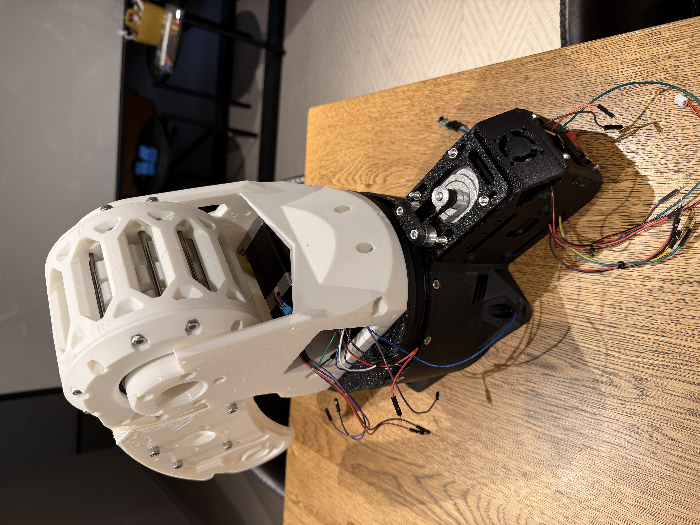
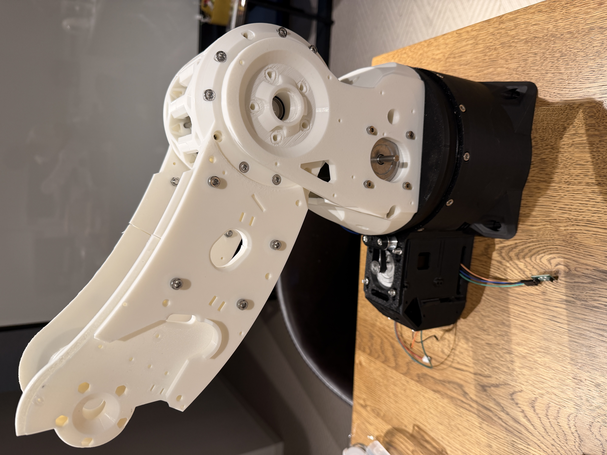  
*Y layer almost done*

---

### 2026-07-10 - Assembly 

Total assembly manual pages completed: 19 pages  
Since "Y cyclo bearings cap"s were not printed yet → skipped few pages in manual → went to upper cores (connected upper cores together, attached bearings to gears for future convenience).  
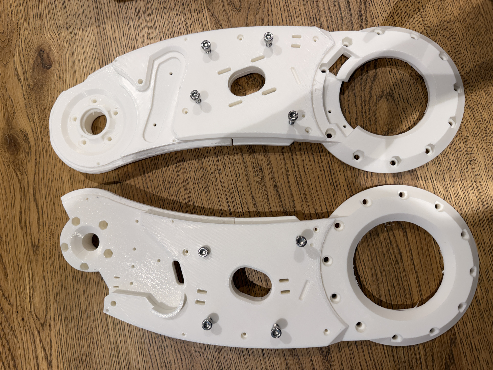
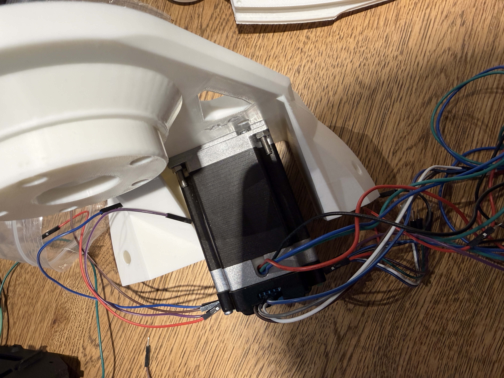
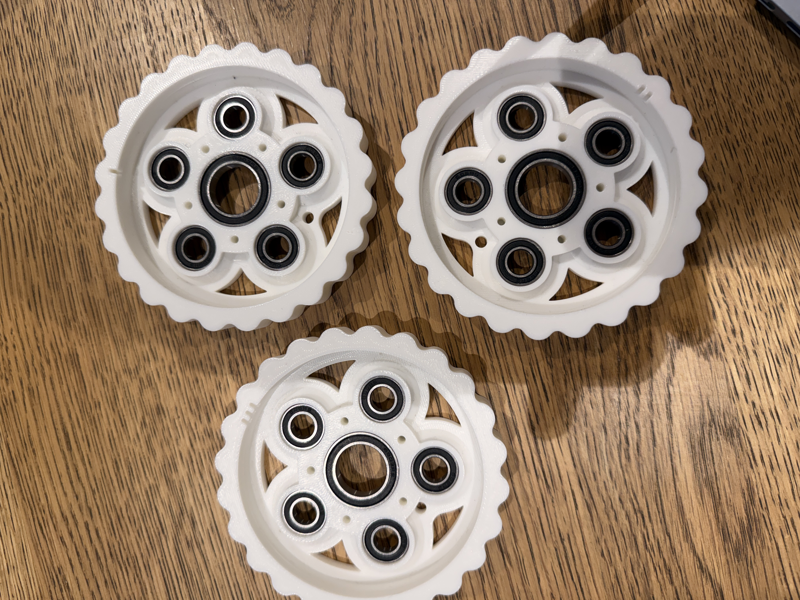  
*Skipped Y lower cores; done Y-to-Z connectors first*

---

### 2026-05-29 - Assembly 7.08% done

Current assembly manual page: p. 18 out of 240 pages (17/240 completed).  
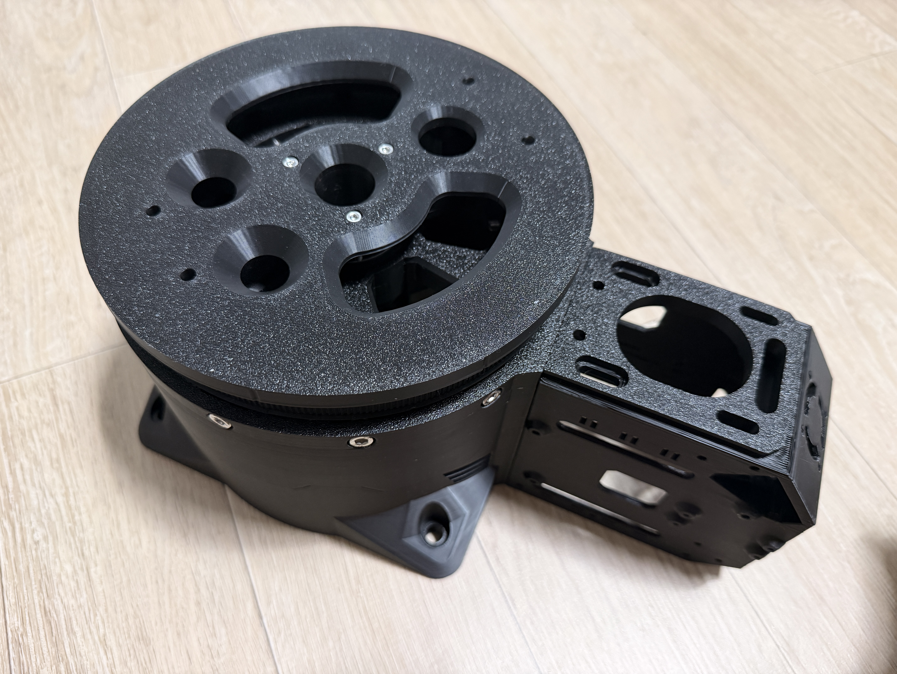
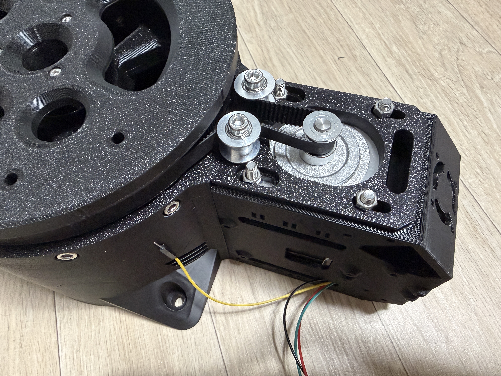
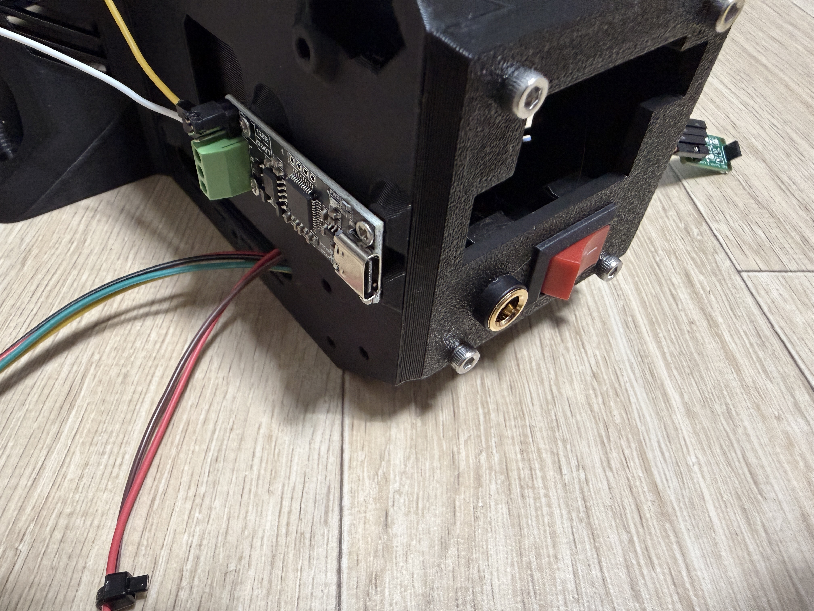  
*Base (J1) completed*

---

### 2026-05-25 - Nema & driver wiring notes

(Reminders for later)  
Stepper wire colour code: black A+ / green A- / red B+ / blue B-  
*swap A+ and A- if rotating opposite*

---

### 2026-05-20 - Wiring 90% completed

3D printing - ongoing  
Wired whole circuit first while printing for easier transfer later.  
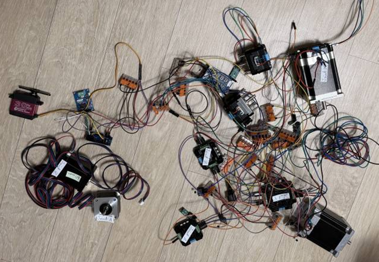  
*Wiring progress check*

---

### 2026-05-13 - Start wiring

Began wiring the circuit while 3D printers are running.  
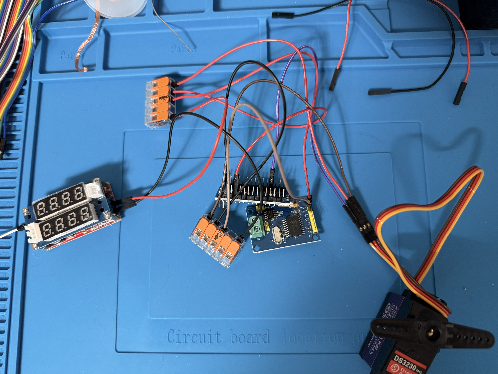  
*First day of wiring*

---

### 2026-05-11 - Parts & materials delivered

Received a whole package of materials from AliExpress. Checked all components.

---

### 2026-05-03 - Drawing schematic view of wiring diagram

Redrawn/converted provided circuit diagram from [Cirkit Designer IDE](https://app.cirkitdesigner.com/) to [EasyEDA](https://easyeda.com/) for convenience later.  
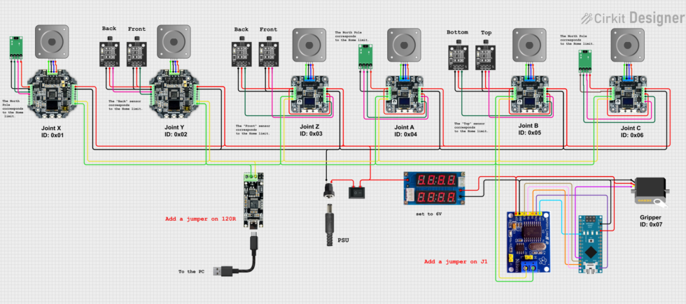
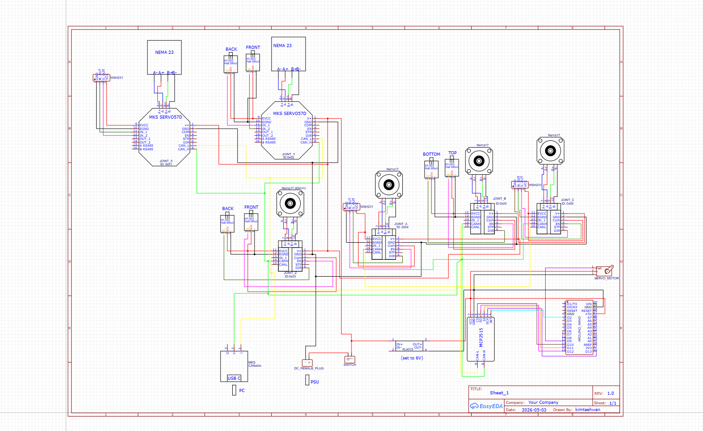  
*Pictorial view --> schematic view*

---

### 2026-05-01 - Parts/materials/CAD-file order & payment

Ordered parts & materials from AliExpress. Paid and downloaded [CAD files](https://arctosrobotics.com/product/cad-files/), and began printing.

---

### 2026-04-27 - Trying in MATLAB & Simulink

Notes: [download zip file](software/Matlab-Simulink-FK) —> extract/open zip file —> open arctos_DataFile.m in MATLAB and run —> open arctos.slx and run  
Library used: **Simscape Multibody**  
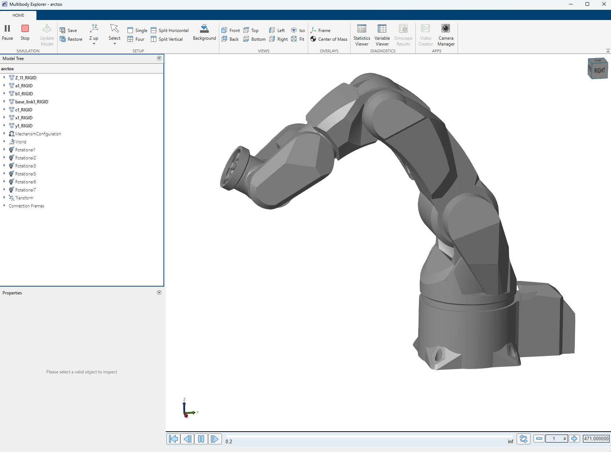
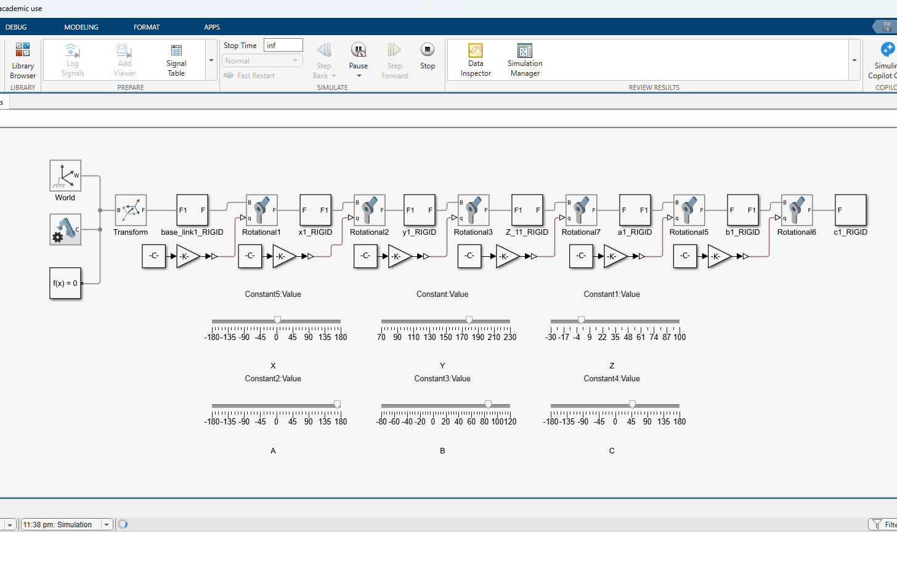  
*Multibody Explorer view of the ARCTOS robot and Simulink forward kinematics model*

---

### 2026-04-23 - Trying software (Arctos Studio)

Downloaded free version of Arctos Studio Pro, and played around with it.  
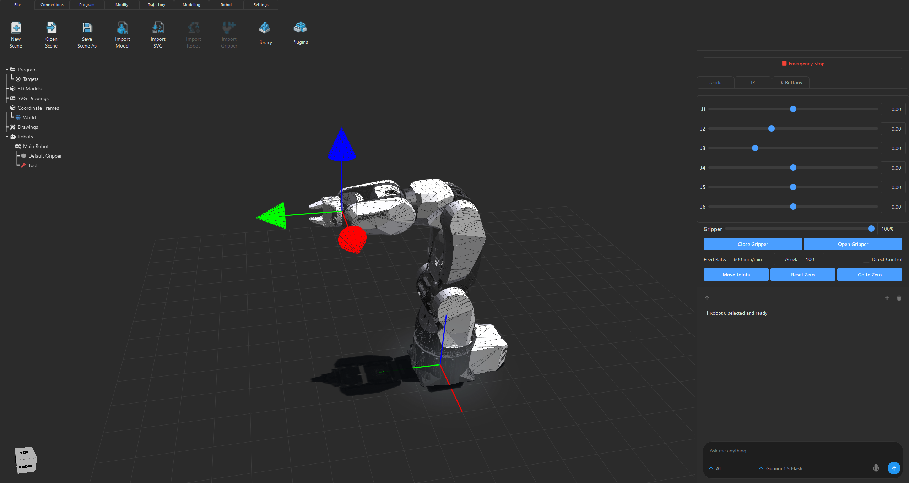  
*Arctos Studio Pro - main screen*

